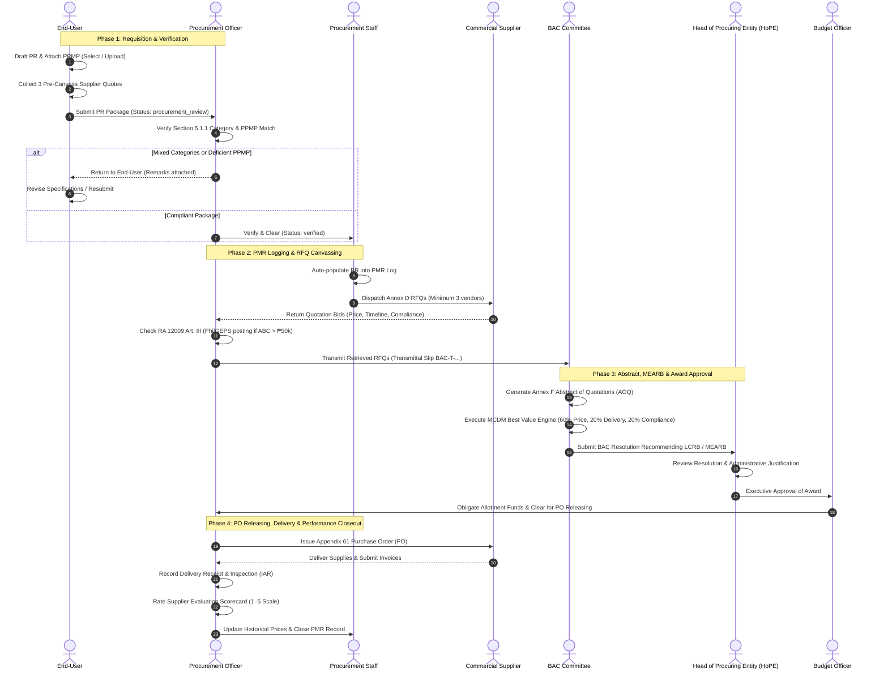

# ProcureWise: End-to-End Detailed Process Flow
### Aligned with Republic Act No. 12009 (New Government Procurement Act - NGPA) & Institutional Procedure 5

---

## 1. High-Level Role Interaction Flowchart (Cross-Functional Swimlane)

```mermaid
flowchart TD
    %% Roles Styling
    classDef endUser fill:#fef3c7,stroke:#d97706,stroke-width:2px,color:#92400e;
    classDef officer fill:#e0e7ff,stroke:#4f46e5,stroke-width:2px,color:#3730a3;
    classDef staff fill:#e0f2fe,stroke:#0284c7,stroke-width:2px,color:#0369a1;
    classDef supplier fill:#f3f4f6,stroke:#4b5563,stroke-width:2px,color:#1f2937;
    classDef bac fill:#fef2f2,stroke:#dc2626,stroke-width:2px,color:#991b1b;
    classDef hope fill:#fdf4ff,stroke:#c026d3,stroke-width:2px,color:#86198f;
    classDef budget fill:#ecfdf5,stroke:#059669,stroke-width:2px,color:#065f46;

    %% ─────────────────────────────────────────────────────────────
    %% STAGE 1: END-USER
    %% ─────────────────────────────────────────────────────────────
    subgraph S1 ["Stage 1: Requisition & Market Scoping (End-User)"]
        EU1["1.1 Market Scoping & PPMP Check<br/><i>(RA 12009 Art. II)</i>"]:::endUser
        EU2["1.2 Create Purchase Request (PR)<br/><i>Select or Upload Custom PPMP</i>"]:::endUser
        EU3{"1.3 Section 5.1.1<br/>Category Check"}:::endUser
        EU4["1.4 Collect & Attach 3 Supplier Quotes<br/><i>Pre-Canvass Envelope (SVP)</i>"]:::endUser
        EU5["1.5 Forward Complete Package<br/><i>Status: procurement_review</i>"]:::endUser
    end

    %% ─────────────────────────────────────────────────────────────
    %% STAGE 2: PROCUREMENT OFFICER (VERIFICATION)
    %% ─────────────────────────────────────────────────────────────
    subgraph S2 ["Stage 2: Administrative Verification & Gatekeeping (Procurement Officer)"]
        PO1["2.1 Receive Package in Queue<br/><i>/officer/pr-verifications</i>"]:::endUser
        PO2{"2.2 Section 5.1.1<br/>Category Segregation &<br/>PPMP Verification"}:::officer
        PO3["2.3 Return for Revision<br/><i>Status: returned (with remarks)</i>"]:::officer
        PO4["2.4 Verify & Clear PR<br/><i>Status: verified</i>"]:::officer
    end

    %% ─────────────────────────────────────────────────────────────
    %% STAGE 3: PROCUREMENT STAFF (PMR & RFQ PREPARATION)
    %% ─────────────────────────────────────────────────────────────
    subgraph S3 ["Stage 3: PMR Logging & RFQ Canvassing (Procurement Staff)"]
        PS1["3.1 Log Verified PR to PMR<br/><i>Auto-populate metadata</i>"]:::staff
        PS2["3.2 Generate Annex D RFQ<br/><i>Official statutory template</i>"]:::staff
        PS3["3.3 Distribute RFQs to Commercial Suppliers<br/><i>Target minimum 3 prospective bidders</i>"]:::staff
    end

    %% ─────────────────────────────────────────────────────────────
    %% STAGE 4: COMMERCIAL SUPPLIERS & PHILGEPS COMPLIANCE
    %% ─────────────────────────────────────────────────────────────
    subgraph S4 ["Stage 4: Quotation Submission & Electronic Posting"]
        SUP1["4.1 Suppliers Prepare & Submit Bids<br/><i>Price, delivery terms, compliance</i>"]:::supplier
        PO_PG{"4.2 ABC > ₱50,000.00?<br/><i>RA 12009 Art. III Check</i>"}:::officer
        PO_PG_YES["4.3 Document PhilGEPS Posting Ref<br/><i>Mandatory 3-day posting guard</i>"]:::officer
        PO_TRANS["4.4 Retrieve & Transmit to BAC<br/><i>Generate Transmittal Slip</i>"]:::officer
    end

    %% ─────────────────────────────────────────────────────────────
    %% STAGE 5: BIDS AND AWARDS COMMITTEE (EVALUATION & MEARB)
    %% ─────────────────────────────────────────────────────────────
    subgraph S5 ["Stage 5: Abstract of Canvass & Best Value Scoring (BAC)"]
        BAC1["5.1 Open & Register Quotation Envelopes<br/><i>Verify min. 3 compliant quotes</i>"]:::bac
        BAC2["5.2 Generate Official Abstract (AOQ Annex F)<br/><i>Side-by-side price comparison vs ABC</i>"]:::bac
        BAC3["5.3 Execute MCDM Best Value Engine<br/><i>60% Price + 20% Delivery + 20% Compliance<br/>(RA 12009 Art. V / MEARB)</i>"]:::bac
        BAC4["5.4 Formulate BAC Resolution<br/><i>Recommend Award to LCRB / MEARB</i>"]:::bac
    end

    %% ─────────────────────────────────────────────────────────────
    %% STAGE 6: EXECUTIVE & FINANCIAL CLEARANCE
    %% ─────────────────────────────────────────────────────────────
    subgraph S6 ["Stage 6: Award Approval & Allotment Obligation"]
        HOPE1{"6.1 HoPE Award Review<br/><i>(Executive Approval)</i>"}:::hope
        HOPE_REJ["Return to BAC with Review Remarks"]:::hope
        HOPE_APP["6.2 Approve Resolution & Notice of Award (NOA)"]:::hope
        BUD1["6.3 Budget Availability & Obligation<br/><i>Commit Allotment (Budget Officer)</i>"]:::budget
    end

    %% ─────────────────────────────────────────────────────────────
    %% STAGE 7: CONTRACT ISSUANCE, DELIVERY & CLOSE-OUT
    %% ─────────────────────────────────────────────────────────────
    subgraph S7 ["Stage 7: Contract Releasing, Inspection & Performance Rating"]
        PO_ISSUE["7.1 Generate Purchase Order (PO Appendix 61)<br/><i>Serve to Awarded Contractor</i>"]:::officer
        SUP_DELIV["7.2 Deliver Goods/Services per PO Terms"]:::supplier
        PO_INSPECT["7.3 Delivery Receipt & Inspection (IAR)<br/><i>Log Complete/Partial Delivery</i>"]:::officer
        PO_RATING["7.4 Rate Supplier Performance<br/><i>Quality, Timeliness, Price, Compliance (1–5)</i>"]:::officer
        PO_CLOSE["7.5 PMR Closeout & Price History Update<br/><i>Record to HistoricalPrices for Forecasting</i>"]:::staff
    end

    %% ─────────────────────────────────────────────────────────────
    %% CONNECTORS BETWEEN STAGES
    %% ─────────────────────────────────────────────────────────────
    EU1 --> EU2
    EU2 --> EU3
    EU3 -- "Mixed Categories Warning" --> EU2
    EU3 -- "Compliant / Acknowledged" --> EU4
    EU4 --> EU5

    EU5 -- "Connector: PR Package Forwarded" --> PO1
    PO1 --> PO2
    PO2 -- "Non-compliant / Split items" --> PO3
    PO3 -- "Connector: Returned for Revision" --> EU2
    PO2 -- "Compliant" --> PO4

    PO4 -- "Connector: Verified PR Package" --> PS1
    PS1 --> PS2
    PS2 --> PS3

    PS3 -- "Connector: RFQ Transmission" --> SUP1
    SUP1 -- "Connector: Quotation Envelopes" --> PO_PG
    PO_PG -- "Yes (> ₱50k)" --> PO_PG_YES
    PO_PG -- "No (≤ ₱50k)" --> PO_TRANS
    PO_PG_YES --> PO_TRANS

    PO_TRANS -- "Connector: Transmittal of Retrieved RFQs" --> BAC1
    BAC1 --> BAC2
    BAC2 --> BAC3
    BAC3 --> BAC4

    BAC4 -- "Connector: BAC Resolution & AOQ" --> HOPE1
    HOPE1 -- "Declined" --> HOPE_REJ
    HOPE_REJ --> BAC1
    HOPE1 -- "Approved" --> HOPE_APP

    HOPE_APP -- "Connector: Approved Award" --> BUD1
    BUD1 -- "Connector: Certified Funds" --> PO_ISSUE

    PO_ISSUE -- "Connector: Issued PO" --> SUP_DELIV
    SUP_DELIV -- "Connector: Delivered Shipments" --> PO_INSPECT
    PO_INSPECT --> PO_RATING
    PO_RATING --> PO_CLOSE
```

---

## 2. Sequential Step-by-Step User Interaction Matrix

The following table provides the operational detail for each actor, including system triggers, inputs, validation rules, and generated documents.

| Step | User / Role | Action / Interface | System Validation & Statutory Guard | Input Artifacts | Output Artifacts |
| :---: | :--- | :--- | :--- | :--- | :--- |
| **1.1** | **End-User** | Workspace Requisition (`/workspace`) | Verifies that proposed requisition aligns with annual procurement plan. | Annual Project Plan | PPMP Draft / Market Survey |
| **1.2** | **End-User** | PR Form (`PurchaseRequestForm`) | Dual-mode PPMP selection: select from approved PPMP or upload custom PPMP (PDF, Excel, Word). | Item Specs, Qty, ABC | Appendix 60 PR Draft |
| **1.3** | **End-User** | Section 5.1.1 Real-Time Classifier | Heuristic parser checks line items against category keywords (Office, Hardware, ICT, Printing, Food). Alerts if mixed. | Requisition Line Items | Category Advisory / Acknowledgement |
| **1.4** | **End-User** | Pre-Canvass Canvassing Modal | Validates that $\ge 3$ supplier quotes are uploaded and non-zero before submission can unlock. | 3 Vendor Price Quotations | Pre-Canvass Envelope (`preCanvasses`) |
| **1.5** | **End-User** | "Forward Package" Button | Verifies all mandatory fields, quote validity, and attachments. Updates status to `procurement_review`. | Completed PR Form | Forwarded PR Package |
| **2.1** | **Procurement Officer** | Officer PR Verification (`/officer/pr-verifications`) | Role-based gate: only Procurement Officer I/II or Officer role can access verification controls. | Forwarded PR Package | Verification Queue Entry |
| **2.2** | **Procurement Officer** | Verification Review Modal | Officer checks category isolation and uploaded PPMP document. | PR Items & Attached PPMP | Clearance Checklist |
| **2.3** | **Procurement Officer** | "Return for Revision" (if non-compliant) | Mandates remarks. Sets PR status to `returned`. Emits high-priority alert to End-User. | Officer Review Notes | Resubmission Ticket |
| **2.4** | **Procurement Officer** | "Verify & Clear" (if compliant) | Sets status to `verified`. Writes immutable audit record to `audit_trails`. | Officer Digital Signature | Cleared PR Package |
| **3.1** | **Procurement Staff** | Staff PMR Recording (`/staff/pmr-recording`) | **Hard Gate:** Blocks recording unless PR has been formally cleared by Procurement Officer. Auto-populates PR metadata. | Verified PR Package | Procurement Monitoring Record |
| **3.2** | **Procurement Staff** | Annex D RFQ Canvas (`OfficialRfqCanvas.tsx`) | Populates official government header, submission deadline, terms & conditions, and line items. | Item Specs & ABC Threshold | Annex D RFQ Document |
| **3.3** | **Procurement Staff** | RFQ Distribution Workbench | Issues RFQs to eligible vendors registered in the Supplier Registry (`/suppliers`). | Commercial Vendor Contacts | Dispatched RFQs |
| **4.1** | **Commercial Suppliers** | Vendor Bid Submission | Suppliers submit quotation sheets detailing unit rates, delivery timelines, and technical compliance. | Blank Annex D RFQ | Completed Quotation Envelopes |
| **4.2** | **Procurement Officer** | RFQ Retrieval & PhilGEPS Check (`/officer/rfqs`) | **RA 12009 Art. III Guard:** If ABC > ₱50,000, system blocks transmittal to BAC until PhilGEPS Ref No. is recorded. | Returned Quotations | PhilGEPS Posting Audit |
| **4.3** | **Procurement Officer** | Transmit to BAC Modal | Generates sequential transmittal tracking code (`BAC-T-YYYY-XXXXXXX`). | Complete Canvass Envelope | BAC Transmittal Slip |
| **5.1** | **BAC Secretariat** | Canvass Opening Workbench | Confirms opening of at least three (3) responsive supplier quotes for Small Value Procurement. | Transmitted Quotations | Sealed Bid Register |
| **5.2** | **BAC Committee** | Abstract of Canvass (`OfficialAbstractOfCanvassCanvas.tsx`) | Side-by-side price comparison matrix. Evaluates bids against ABC and determines Lowest Calculated Bid (LCB). | Quotation Line Items | Annex F Abstract of Quotations (AOQ) |
| **5.3** | **BAC Committee** | MCDM Best Value Engine (`calculateMcdmScores`) | **RA 12009 Art. V (MEARB):** Scores bids using balanced formula: Price (60%), Delivery (20%), Compliance (20%). Identifies LCRB. | Evaluated AOQ Data | MCDM Recommendation Record |
| **5.4** | **BAC Committee** | Draft BAC Resolution | Committee formalizes recommendation of award to the Lowest Calculated & Responsive Bidder (LCRB). | MCDM Scoring Results | BAC Award Resolution |
| **6.1** | **HoPE** | Executive Approval Workbench (`/approvals`) | Authorizing official (College President / VP) evaluates BAC recommendation and justifications. | BAC Resolution & AOQ | Executive Decision Record |
| **6.2** | **HoPE** | "Approve Award" | Sets abstract and PR status to `approved`. Authorizes PO generation and contract release. | Executive Digital Sign-Off | Notice of Award (NOA) |
| **6.3** | **Budget Officer** | Budget Utilization (`/budgets`) | Verifies remaining balance and encumbers funds from department allotment to formal obligation. | Approved PR & Awarded Sum | Obligation Request (ObR) |
| **7.1** | **Procurement Officer** | PO Generation Canvas (`purchase_order`) | Generates standard Appendix 61 Purchase Order. Binds payment/delivery terms and penalty clauses. | Approved AOQ & NOA | Official PO (Appendix 61) |
| **7.2** | **Commercial Contractor**| Order Fulfillment | Contractor manufactures, packs, and delivers goods to the Supply Office destination within PO deadline. | Signed PO / Conforme | Physical Delivery Shipment |
| **7.3** | **Procurement / Supply** | Delivery Monitoring (`/officer/delivery-monitoring`) | Logs shipment receipt, partial vs. complete delivery, inspection pass/fail, and calculates turnaround cycle time. | Delivery Invoices & Waybills | Inspection & Acceptance (IAR) |
| **7.4** | **Procurement Officer** | Supplier Rating (`/supplier-evaluations`) | Scores contractor across 4 criteria (Quality, Timeliness, Price Competitiveness, Compliance). | Inspection Results | Supplier Scorecard |
| **7.5** | **Procurement Staff** | PMR Finalization & Forecasting | Records unit prices to `historicalPrices` table. Recharts generates linear regression price forecast curves. | Final Delivery Sign-off | Updated PMR & Price Forecast |

---

## 3. Detailed Data & Artifact Flow Diagram

---

## 4. Key Statutory Checkpoints Under RA 12009 (NGPA)

1. **Section 5.1.1 Category Segregation Rule:**
   - **Enforcement Point:** End-User PR Workspace & Procurement Officer Verification Queue.
   - **Mandate:** Requisitions must separate *Office Supplies*, *Hardware Supplies*, *ICT Supplies*, *Printing Services*, and *Food Ingredients*. Prevents improper bundling and ensures accurate market scoping.

2. **Article III Electronic Procurement & PhilGEPS Posting Guard:**
   - **Enforcement Point:** Procurement Officer RFQ Distribution & Transmittal Workbench.
   - **Mandate:** Procurement packages under Small Value Procurement with an ABC $> \text{₱}50,000.00$ cannot be transmitted to BAC without a recorded PhilGEPS posting reference number.

3. **Article V / Section 43 MEARB (Best Value) Engine:**
   - **Enforcement Point:** BAC Abstract of Canvass Evaluation.
   - **Mandate:** Evaluates bids not solely on lowest nominal price, but on the **Most Economically Advantageous and Responsive Bid (MEARB)** through Multi-Criteria Decision Making (MCDM):
     $$\text{Total Score} = \left(\frac{\text{Lowest Compliant Price}}{\text{Quote Price}} \times 60\right) + \left(\frac{\text{Fastest Delivery Days}}{\text{Quote Delivery Days}} \times 20\right) + 20_{\text{compliance}}$$

4. **Strategic Planning & Life-Cycle Forecasting (Article II):**
   - **Enforcement Point:** Procurement Officer Forecasting Dashboard (`/officer/forecast`).
   - **Mandate:** Tracks historical item procurement costs across quarters, projecting price trajectories to prevent budgetary shortfalls.
