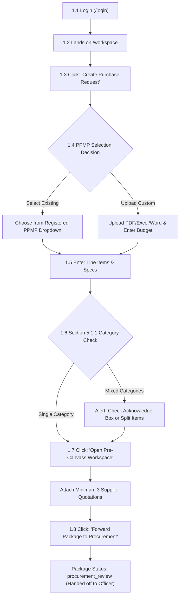
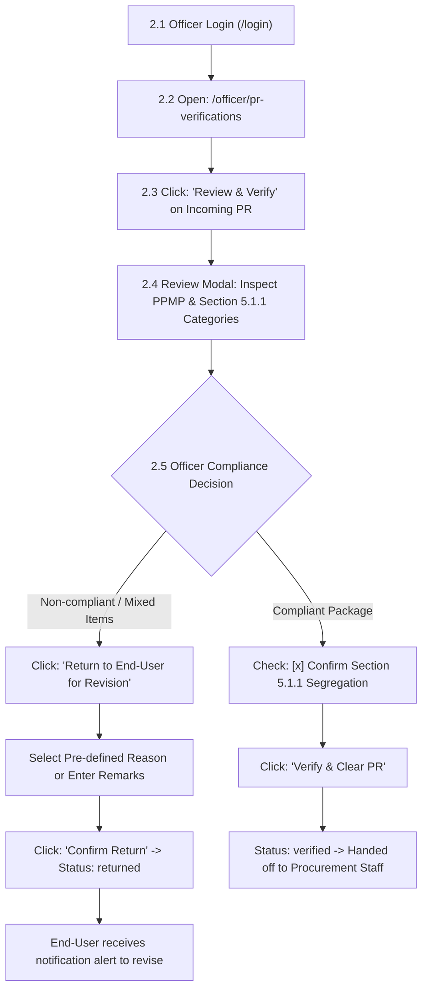
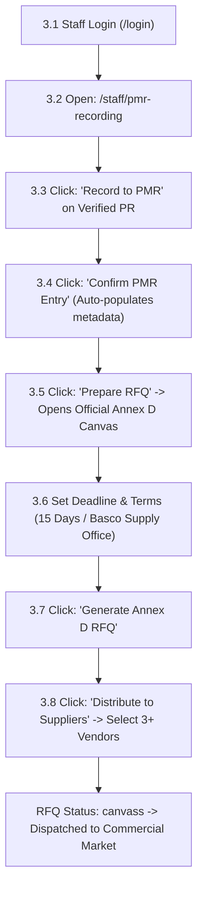
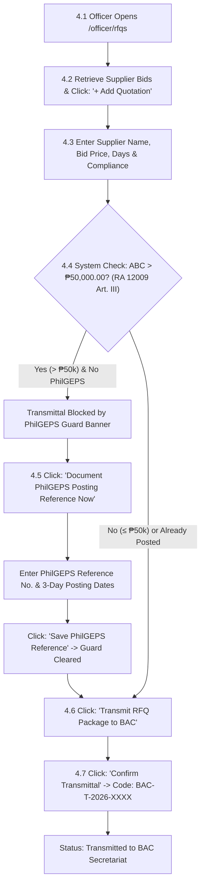
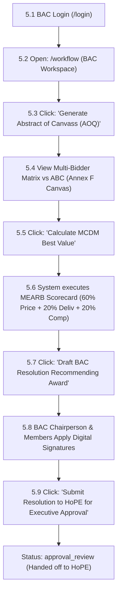
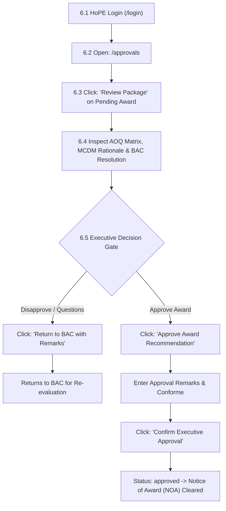
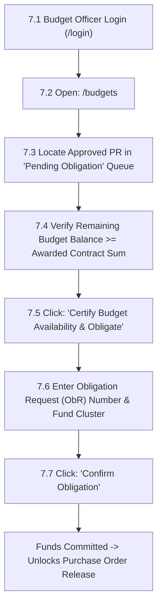
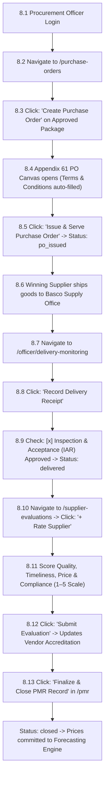

# ProcureWise: Ultra-Detailed Button-by-Button Process Flow
### Comprehensive Screen-by-Screen, Click-by-Click, and Decision-by-Decision Manual
#### Aligned with Republic Act No. 12009 (New Government Procurement Act - NGPA) & Institutional Procedure 5

---

## Overview of Actors & Credentials

| Role | Demo Email | Initial Route | Primary Duty |
| :--- | :--- | :--- | :--- |
| **1. End-User** | `enduser.demo@bsc.edu.ph` | `/workspace` | PR creation, custom PPMP upload, Section 5.1.1 check, pre-canvass quotes |
| **2. Procurement Officer** | `officer.demo@bsc.edu.ph` | `/officer/pr-verifications` | Administrative verification, Section 5.1.1 gatekeeping, PhilGEPS posting |
| **3. Procurement Staff** | `staff.demo@bsc.edu.ph` | `/staff/pmr-recording` | PMR logging, Annex D RFQ generation, vendor canvassing |
| **4. Commercial Supplier** | *External Bidder* | *Quotation Envelope* | Submits commercial quotation bids |
| **5. BAC Secretariat / Committee** | `bac.demo@bsc.edu.ph` | `/workflow` | Opening, Abstract of Canvass (Annex F), MCDM Best Value (MEARB) |
| **6. Head of Procuring Entity (HoPE)**| `hope.demo@bsc.edu.ph` | `/approvals` | Executive award review, administrative clearance, Notice of Award (NOA) |
| **7. Budget Officer** | `budget.demo@bsc.edu.ph` | `/budgets` | Allotment availability verification, fund commitment and obligation (ObR) |
| **8. Supply & Inspection / Officer** | `officer.demo@bsc.edu.ph` | `/officer/delivery-monitoring`| PO issuance, delivery receipt, IAR inspection, supplier performance ratings |

---

## 1. End-User Requisition Workflow (Step-by-Step)

### Detailed Screen & Button Steps:
1. **Login:**
   - Navigate to `/login`.
   - Enter Email: `enduser.demo@bsc.edu.ph`, Password: `password`.
   - **Click Button:** `[Sign In]`.
2. **Landing Page:**
   - System redirects to `/workspace` (Employee Requisition Workspace).
3. **Initiating Request:**
   - **Click Button:** `[+ Create Purchase Request]` located in the top-right header.
   - The slide-over panel **"New Purchase Request"** opens.
4. **PPMP Linkage Decision:**
   - **Choice A (Existing):** Click radio button `[Select from Approved PPMP]` $\rightarrow$ select your department's item category from the dropdown (e.g., *Office Supplies PPMP 2026*).
   - **Choice B (Custom Upload):** Click radio button `[Upload / Register PPMP]` $\rightarrow$ Click `[Browse File]` (attach PDF, Excel, Word up to 14MB) $\rightarrow$ enter PPMP Title and Estimated Allotment.
5. **Item Specification & Section 5.1.1 Real-Time Check:**
   - Fill in: Requisition Purpose (e.g., *"Procurement of Office Supplies for 1st Quarter"*), Fund Cluster (*Regular Agency Fund*), Delivery Term (*15 Calendar Days*).
   - **Click Button:** `[+ Add Item Line]`.
   - Enter: Item Description, Quantity, Unit (e.g., *ream*), Estimated Unit Price (e.g., *₱285.00*).
   - **Automated Rule Trigger:** The real-time parser classifies each line item.
     - *If all items are Office Supplies:* Green status indicator displays *"Compliant with Section 5.1.1"*.
     - *If items are mixed (e.g., Bond paper + Desktop Computer):* Amber warning banner appears:
       > *"Section 5.1.1 Mandated Category Segregation Alert: Mixed Categories Detected."*
     - **Decision:** The user can either delete the incompatible item, or check the mandatory acknowledgement checkbox:
       `[x] "I acknowledge that this package has mixed categories and may be returned under Section 5.1.1"`.
6. **Pre-Canvass Canvassing Quotes:**
   - Scroll down to the **Pre-Canvass Supplier Quotations** section.
   - **Click Button:** `[+ Add Supplier Quotation]`.
   - Select Supplier 1 (e.g., *Universal Commercial Supplies*) $\rightarrow$ enter Quoted Total Price $\rightarrow$ enter Delivery Days $\rightarrow$ Click `[Save Quote]`.
   - Repeat for Supplier 2 (e.g., *Standard Goods Enterprise*).
   - Repeat for Supplier 3 (e.g., *Ivatan General Merchandise*).
   - Indicator turns green: *"3 of 3 Required Quotes Attached"*.
7. **Forwarding to Procurement:**
   - **Click Button:** `[Forward Package to Procurement]` at the bottom of the form.
   - A loading spinner displays while the package is sealed and audit-logged.
   - Success toast appears: *"Purchase Request PR-2026-XXXX submitted successfully."*
   - Status changes to `procurement_review`.
   - **Connector:** The package disappears from the End-User draft queue and is instantly transmitted to the Procurement Officer's verification desk.

---

## 2. Procurement Officer Administrative Verification (Step-by-Step)

### Detailed Screen & Button Steps:
1. **Login:**
   - Sign in as `officer.demo@bsc.edu.ph`.
2. **Navigate to Queue:**
   - In the left sidebar, **Click:** `[PR Verifications]` (URL: `/officer/pr-verifications`).
   - The queue shows all pending submissions under *"Incoming PRs Awaiting Section 5.1.1 Verification"*.
3. **Open Inspection Modal:**
   - Locate the target PR row.
   - **Click Button:** `[Review & Verify]`.
   - The modal displays PR details, item list, calculated ABC, and category classifications.
   - If a custom PPMP was uploaded, an attachment badge appears: **Click Button:** `[View Uploaded PPMP]` to preview the file.
4. **Officer Decision Gate:**
   - **Path A: Return for Revision (Non-Compliant):**
     - If line items violate category segregation without justification:
     - **Click Button:** `[Return to End-User for Revision]`.
     - In the dropdown, select: `"Mixed item categories detected (Section 5.1.1 Non-compliant)"`.
     - **Click Button:** `[Confirm Return]`.
     - Toast: *"Purchase Request returned to End-User for revision."*
     - The PR status changes to `returned` and alerts the End-User.
   - **Path B: Verify & Clear (Compliant):**
     - If specifications and categories are strictly segregated:
     - Check the required verification box: `[x] "I have verified item specifications and category segregation under Section 5.1.1"`.
     - **Click Button:** `[Verify & Clear PR]`.
     - Toast: *"PR & PPMP package successfully verified under Section 5.1.1. Advanced to Procurement Staff for PMR recording."*
     - Status updates to `verified` / `procurement_review`.
     - **Connector:** The record unlocks in the Procurement Staff workbench.

---

## 3. Procurement Staff PMR Logging & RFQ Canvassing (Step-by-Step)

### Detailed Screen & Button Steps:
1. **Login:**
   - Sign in as `staff.demo@bsc.edu.ph`.
2. **Navigate to PMR Recording Workbench:**
   - In sidebar, **Click:** `[PMR Recording]` (URL: `/staff/pmr-recording`).
   - The table shows verified PRs ready for registry. Note: unverified PRs are blocked.
3. **Log to PMR:**
   - Locate the verified PR.
   - **Click Button:** `[Record to PMR]`.
   - The dialog automatically populates PR number, requisition date, requesting department, and ABC.
   - **Click Button:** `[Confirm PMR Entry]`.
   - System registers the tracking code and updates the PMR master spreadsheet.
4. **Generate Official Annex D Request for Quotation (RFQ):**
   - On the same row, **Click Button:** `[Prepare RFQ]`.
   - The system opens the **Official Annex D RFQ Canvas** (`OfficialRfqCanvas.tsx`).
   - System assigns official sequential code: `RFQ-2026-XXXX`.
   - Set Canvass Deadline: Select date (7 calendar days forward) and time (5:00 PM).
   - Set Delivery Terms: *"15 Calendar Days upon receipt of PO"*, Place of Delivery: *"BSC Supply Office"*.
   - **Click Button:** `[Generate Annex D RFQ]`.
   - Optional: **Click Button:** `[Print Official RFQ]` to download or preview the A4 PDF format.
5. **Dispatch RFQ to Commercial Suppliers:**
   - **Click Button:** `[Distribute RFQ to Suppliers]`.
   - Select at least three (3) accredited vendors from the registry checklist.
   - **Click Button:** `[Dispatch Invitations]`.
   - Toast: *"RFQ successfully dispatched. Market canvassing initiated."*
   - Status updates to `rfq` / `canvass`.
   - **Connector:** The procurement advances to quotation collection and electronic posting.

---

## 4. RFQ Retrieval & PhilGEPS Posting Guard (Procurement Officer)

### Detailed Screen & Button Steps:
1. **Navigate to RFQ Workbench:**
   - Procurement Officer navigates to `/officer/rfqs` (RFQ Distribution & Retrieval).
2. **Log Supplier Quotations:**
   - As sealed vendor envelopes are opened, for each vendor:
   - **Click Button:** `[+ Record Supplier Quotation]`.
   - Select Supplier $\rightarrow$ enter Quoted Total Amount (e.g. *₱82,500.00*) $\rightarrow$ enter Delivery Days (e.g. *10 days*) $\rightarrow$ toggle Compliance Statement: `[Compliant]`.
   - **Click Button:** `[Save Quotation]`. Repeat until all 3 quotations are recorded.
3. **PhilGEPS Statutory Posting Guard (RA 12009 Article III):**
   - The system checks if the PR ABC exceeds **₱50,000.00**.
   - *If ABC > ₱50,000 and PhilGEPS is unrecorded:*
     - The transmittal button is blocked with an amber alert:
       > *"RA 12009 (NGPA) Article III / PhilGEPS Electronic Posting Compliance Guard"*
     - **Click Button:** `[Document PhilGEPS Posting Reference Now]`.
     - Dialog opens: Enter PhilGEPS Reference Number (e.g. `PHILGEPS-2026-88192`), Posting Date, and Closing Date.
     - **Click Button:** `[Save PhilGEPS Reference]`.
     - Toast: *"PhilGEPS electronic posting reference logged successfully."*
4. **Transmit to BAC Secretariat:**
   - Once all 3 quotes and PhilGEPS (if applicable) are complete:
   - **Click Button:** `[Transmit RFQ Package to BAC]`.
   - Dialog opens: Confirm recipient office (*"Bids and Awards Committee Secretariat"*).
   - **Click Button:** `[Confirm Transmittal]`.
   - System assigns sequential transmittal tracking slip: `BAC-T-2026-XXXXXXX`.
   - **Connector:** The complete quotation dossier is handed off to the BAC Secretariat.

---

## 5. BAC Abstract of Canvass & MEARB Best Value Evaluation (Step-by-Step)

### Detailed Screen & Button Steps:
1. **Login:**
   - Sign in as `bac.demo@bsc.edu.ph` (BAC Secretariat / Member).
2. **Navigate to BAC Workspace:**
   - In sidebar, **Click:** `[Workflow / Canvassing]` (URL: `/workflow`).
   - Under *"Transmitted RFQ Packages"*, locate the transmitted package.
3. **Generate Official Abstract of Quotations (AOQ):**
   - **Click Button:** `[Generate Abstract of Canvass]`.
   - The screen opens the **Official Annex F Abstract of Canvass Canvas** (`OfficialAbstractOfCanvassCanvas.tsx`).
   - The canvas renders a multi-column comparative grid:
     - Supplier 1 vs. Supplier 2 vs. Supplier 3.
     - Evaluates each line item bid against ABC threshold.
     - Identifies the nominal Lowest Calculated Bidder (LCB).
   - **Click Button:** `[Save Official Abstract]`.
4. **Execute MEARB Best Value Recommendation Engine (RA 12009 Article V):**
   - In the decision support section, **Click Button:** `[Calculate MCDM Best Value]`.
   - The algorithm executes:
     $$\text{Price Score (60\%)} = \left(\frac{\text{Lowest Price}}{\text{Quote Price}}\right) \times 60$$
     $$\text{Delivery Score (20\%)} = \left(\frac{\text{Fastest Days}}{\text{Quote Days}}\right) \times 20$$
     $$\text{Compliance Score (20\%)} = 20$$
   - A scorecard leaderboard appears ranking bidders by composite score.
   - Highlights the **Lowest Calculated and Responsive Bidder (LCRB / MEARB)**.
5. **Draft & Sign BAC Resolution:**
   - **Click Button:** `[Draft BAC Resolution]`.
   - Resolution text auto-populates recommending award to the highest-scoring compliant vendor.
   - Participating BAC members check the approval box and apply digital sign-off.
6. **Submit to HoPE:**
   - **Click Button:** `[Submit Resolution to HoPE for Executive Approval]`.
   - Toast: *"BAC Resolution and Abstract submitted to Head of Procuring Entity."*
   - Status updates to `approval_review`.
   - **Connector:** The package advances to the College President / HoPE.

---

## 6. Head of Procuring Entity (HoPE) Executive Award Approval (Step-by-Step)

### Detailed Screen & Button Steps:
1. **Login:**
   - Sign in as `hope.demo@bsc.edu.ph` (College President / Head of Procuring Entity).
2. **Navigate to Approvals:**
   - In sidebar, **Click:** `[Approvals]` (URL: `/approvals`).
   - Under *"Pending Administrative Reviews"*, view the BAC Resolution item.
3. **Review Dossier:**
   - **Click Button:** `[Review Package]`.
   - HoPE inspects the Abstract of Canvass, supplier quotation breakdown, BAC Committee signatures, and MCDM Best Value score.
4. **Executive Decision:**
   - **Choice A: Return to BAC:**
     - **Click Button:** `[Return to BAC with Remarks]`.
     - Enter reason $\rightarrow$ Click `[Confirm Return]`.
   - **Choice B: Approve Award:**
     - **Click Button:** `[Approve Award Recommendation]`.
     - In the confirmation dialog, enter official remarks:
       `"Approved for contract issuance and PO generation per RA 12009 (NGPA)."`
     - **Click Button:** `[Confirm Executive Approval]`.
     - Toast: *"Executive Award Approval granted. Notice of Award (NOA) cleared."*
     - Status updates to `approved`.
     - **Connector:** Handed off to Budget Officer for fund obligation and Procurement Officer for PO issuance.

---

## 7. Budget Officer Allotment Obligation (Step-by-Step)

### Detailed Screen & Button Steps:
1. **Login:**
   - Sign in as `budget.demo@bsc.edu.ph`.
2. **Navigate to Budget Management:**
   - In sidebar, **Click:** `[Budgets & Allotments]` (URL: `/budgets`).
3. **Obligate Funds:**
   - Under *"Approved Contracts Awaiting Obligation"*, find the awarded PR.
   - The card displays Allotment vs. Committed vs. Net Balance.
   - **Click Button:** `[Certify Budget Availability & Obligate]`.
   - Modal opens: Enter ObR Number (e.g. `OBR-2026-04-0012`).
   - **Click Button:** `[Confirm Obligation]`.
   - Toast: *"Budget obligation certified. Funds encumbered for Purchase Order."*
   - **Connector:** Procurement Officer receives authorization to issue the Purchase Order.

---

## 8. Purchase Order Issuance, Delivery Inspection & Performance Close-Out

### Detailed Screen & Button Steps:
1. **Generate Purchase Order (Appendix 61):**
   - Procurement Officer navigates to `/purchase-orders`.
   - On the approved package row, **Click Button:** `[Create Purchase Order]`.
   - The system opens the **Appendix 61 Purchase Order Canvas** (`purchase_order`).
   - Auto-populates: Awarded Supplier name, Address, TIN, PhilGEPS number, Item Specifications, Contract Amount in Words, and Delivery/Payment Terms.
   - **Click Button:** `[Issue & Serve Purchase Order]`.
   - System assigns official PO number: `PO-2026-XXXX`.
   - Status updates to `po_issued`.
2. **Delivery Receipt & Inspection (IAR):**
   - When the supplier delivers goods to Batanes State College:
   - Navigate to `/officer/delivery-monitoring`.
   - **Click Button:** `[Record Delivery Receipt]`.
   - Modal opens:
     - Enter Delivery Receipt (DR) Number.
     - Select Delivery Status: `[Complete Delivery]`.
     - Check: `[x] "Inspection and Acceptance Report (IAR) Approved - All items conform to specifications"`.
   - **Click Button:** `[Confirm Delivery Record]`.
   - Toast: *"Delivery receipt logged. Turnaround cycle time calculated."*
   - Status updates to `delivered`.
3. **Supplier Performance Evaluation Scorecard:**
   - In sidebar, **Click:** `[Supplier Evaluations]` (URL: `/supplier-evaluations`).
   - **Click Button:** `[+ Rate Supplier Performance]`.
   - Select the completed PO and supplier.
   - Rate the 4 standard rubrics (1 to 5 scale):
     - Quality Score (1–5)
     - Timeliness Score (1–5)
     - Price Competitiveness Score (1–5)
     - Compliance & Communication Score (1–5)
   - **Click Button:** `[Submit Evaluation & Sign]`.
   - Toast: *"Supplier performance rating recorded. Registry scorecard updated."*
4. **PMR Close-Out & Forecasting Ingestion:**
   - Navigate to `/pmr` (PMR Registry).
   - Locate the delivered contract.
   - **Click Button:** `[Finalize & Close PMR Record]`.
   - System sets status to `closed` / `pmr_logged`.
   - **Automatic Forecasting Feed:** The final unit prices are automatically committed to the `historicalPrices` table.
   - Navigating to `/officer/forecast` immediately renders the updated historical price trajectory and linear regression forecast line chart.

---

## 9. Comprehensive Button & Action Master Table

| Role | Screen | Action Trigger (Button / Checkbox) | Mandatory Pre-Conditions | System Effect / Next State |
| :--- | :--- | :--- | :--- | :--- |
| **End-User** | `/workspace` | `[+ Create Purchase Request]` | Authenticated End-User | Opens PR creation drawer |
| **End-User** | Drawer | `[Upload / Register PPMP]` | File $\le 14$MB attached | Creates `appPpmpEntry` record |
| **End-User** | Drawer | `[x] "I acknowledge mixed categories..."`| Mixed categories detected | Unlocks package forwarding |
| **End-User** | Pre-Canvass | `[+ Add Supplier Quotation]` | Valid vendor & price $>0$ | Adds quote candidate to count |
| **End-User** | Drawer | `[Forward Package to Procurement]` | $\ge 3$ valid quotes attached | Status: `procurement_review` |
| **Officer** | `/officer/pr-verifications` | `[Review & Verify]` | Package in queue | Opens Officer verification modal |
| **Officer** | Modal | `[Return to End-User for Revision]` | Rejection remarks entered | Status: `returned` |
| **Officer** | Modal | `[Verify & Clear PR]` | Section 5.1.1 box checked | Status: `verified` |
| **Staff** | `/staff/pmr-recording` | `[Record to PMR]` | PR status is `verified` | Creates master PMR row |
| **Staff** | `/staff/pmr-recording` | `[Generate Annex D RFQ]` | PMR entry exists | Creates `rfq` record (Annex D) |
| **Staff** | Workbench | `[Distribute RFQ to Suppliers]` | $\ge 3$ vendors selected | Status: `rfq` / `canvass` |
| **Officer** | `/officer/rfqs` | `[Document PhilGEPS Reference]` | ABC $> \text{₱}50,000.00$ | Unlocks transmittal to BAC |
| **Officer** | `/officer/rfqs` | `[Transmit RFQ Package to BAC]` | PhilGEPS check passed | Generates `BAC-T-2026-XXXX` |
| **BAC** | `/workflow` | `[Generate Abstract of Canvass]` | $\ge 3$ quotes received | Generates Annex F AOQ matrix |
| **BAC** | Canvas | `[Calculate MCDM Best Value]` | AOQ generated | Computes MEARB balanced scores |
| **BAC** | Resolution | `[Submit Resolution to HoPE]` | BAC signatures applied | Status: `approval_review` |
| **HoPE** | `/approvals` | `[Approve Award Recommendation]` | BAC Resolution submitted | Status: `approved` (NOA Cleared) |
| **Budget** | `/budgets` | `[Certify Budget Availability]` | Status is `approved` | Encumbers allotment to ObR |
| **Officer** | `/purchase-orders` | `[Create Purchase Order]` | ObR & Award approved | Generates Appendix 61 PO |
| **Officer** | `/purchase-orders` | `[Issue & Serve Purchase Order]` | PO terms finalized | Status: `po_issued` |
| **Officer** | `/officer/delivery-monitoring`| `[Record Delivery Receipt]` | Physical delivery arrived | Status: `delivered` |
| **Officer** | `/supplier-evaluations` | `[Submit Evaluation & Sign]` | Delivery inspected | Updates vendor scorecard (1–5) |
| **Staff** | `/pmr` | `[Finalize & Close PMR Record]` | Delivery & eval complete | Status: `closed`; feeds forecast |
