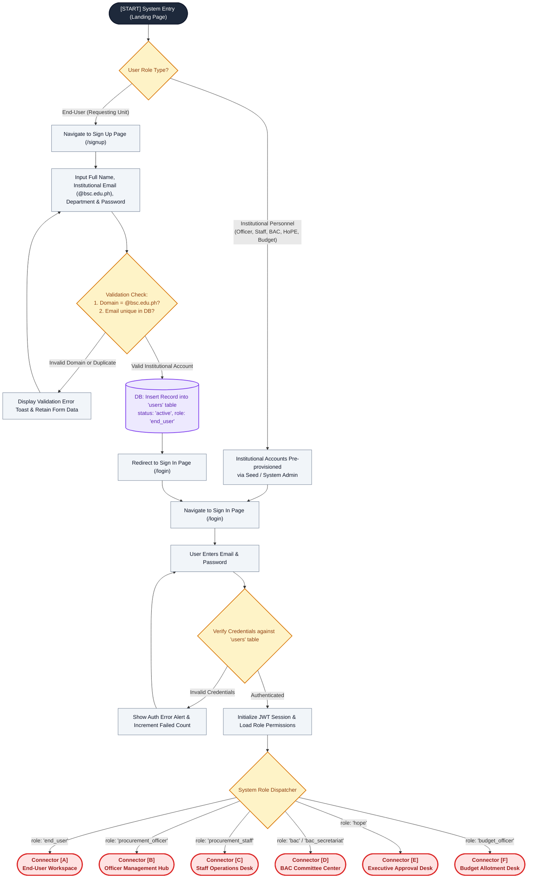
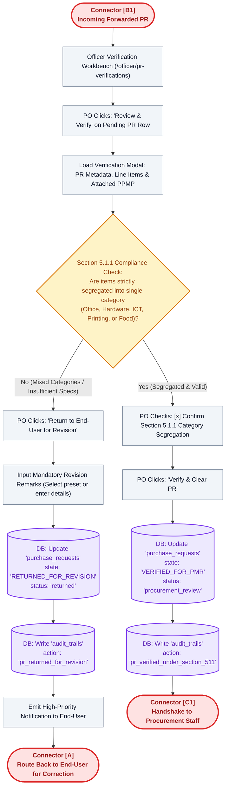
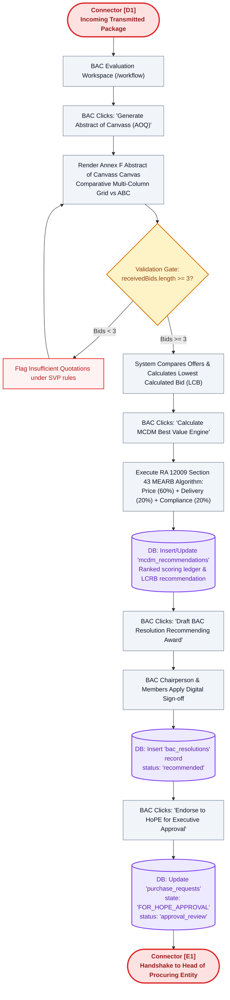
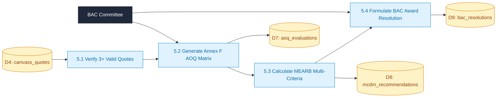

# Batanes State College Procurement Management System (ProcureWise)
## Comprehensive System Workflow Flowchart & Data Flow Diagram (DFD)
#### Aligned with Republic Act No. 12009 (New Government Procurement Act - NGPA) & Institutional Procedure 5

---

# SECTION I: MODULAR SYSTEM WORKFLOW FLOWCHART

The end-to-end procurement lifecycle is decomposed into seven (7) sequentially linked sub-diagrams connected via standardized connector symbols (`[A]`, `[B]`, `[B1]`, `[C1]`, `[D1]`, `[E1]`, `[F1]`, `[C2]`, `[B2]`).

---

### Diagram Part 1: Entry, Identity & Authentication Flow

---

### Diagram Part 2: End-User Requisition & Pre-Canvass (`Connector [A]`)

```mermaid
graph TD
    classDef connectorNode fill:#fee2e2,stroke:#dc2626,stroke-width:3px,color:#991b1b,font-weight:bold;
    classDef decisionNode fill:#fef3c7,stroke:#d97706,stroke-width:2px,color:#92400e;
    classDef actionNode fill:#f1f5f9,stroke:#64748b,stroke-width:1px,color:#0f172a;
    classDef dbNode fill:#ede9fe,stroke:#7c3aed,stroke-width:2px,color:#5b21b6;
    classDef alertNode fill:#fef2f2,stroke:#ef4444,stroke-width:2px,color:#b91c1c;

    CONN_A(["Connector [A]<br/>Incoming from Sign In"]):::connectorNode
    CONN_A_RET(["Connector [A]<br/>Incoming Return from PO"]):::connectorNode

    DASH_EU["End-User Dashboard (/workspace)"]:::actionNode
    CONN_A --> DASH_EU
    CONN_A_RET --> DASH_EU

    DASH_EU --> CLK_NEW_PR["Click: '+ Create Purchase Request'"]:::actionNode
    CLK_NEW_PR --> STEP1_PPMP["Step 1: Department PPMP Prerequisite Gate<br/><i>(RA 12009 Art. II Mandatory PPMP Verification)</i>"]:::actionNode

    STEP1_PPMP --> PPMP_DEC{"PPMP Method Decision"}:::decisionNode
    PPMP_DEC -- "Upload Department PPMP" --> PPMP_UPLOAD["Upload Document (PDF/Excel/Word/Scan),<br/>Title, Office, Expenditure Object & Budget"]:::actionNode
    PPMP_UPLOAD --> DB_PPMP[("DB: Create 'appPpmpEntry' Record<br/>& Store Attached Document")]:::dbNode
    PPMP_DEC -- "Select Existing" --> PPMP_LIST["Select Registered PPMP from Dropdown"]:::actionNode

    DB_PPMP --> LOCK_PPMP["Step 2: Lock Verified PPMP & Open PR Canvas"]:::actionNode
    PPMP_LIST --> LOCK_PPMP

    LOCK_PPMP --> PR_DETAILS["Fill PR Header: Purpose, Fund Cluster, Delivery Term<br/><i>(Office & Budget locked to Verified PPMP)</i>"]:::actionNode
    PR_DETAILS --> ADD_ITEMS["Click '+ Add Item Line': Input Description, Qty, Unit, Unit Cost"]:::actionNode
    ADD_ITEMS --> SEC_511_CHK{"Real-time Section 5.1.1 Category Parser"}:::decisionNode
    
    SEC_511_CHK -- "Mixed Categories Detected<br/>(Office + Hardware + ICT + etc.)" --> SEC_WARN["Display Amber Section 5.1.1 Banner:<br/>Separate items or check mandatory acknowledgement"]:::alertNode
    SEC_WARN --> ACK_BOX{"User Action?"}:::decisionNode
    ACK_BOX -- "Split Request" --> ADD_ITEMS
    ACK_BOX -- "Acknowledge" --> CHK_ACK["Check: [x] Acknowledge package contains mixed categories"]:::actionNode

    SEC_511_CHK -- "Single Category" --> OPEN_CANVASS["Open Pre-Canvass Quotation Section"]:::actionNode
    CHK_ACK --> OPEN_CANVASS

    OPEN_CANVASS --> ATTACH_QUOTES["Upload Supplier Quotations (Price, Delivery Days, Conforme)"]:::actionNode
    ATTACH_QUOTES --> QUOTE_COUNT{"Validation Gate:<br/>quotes.length >= 3?"}:::decisionNode

    QUOTE_COUNT -- "quotes < 3" --> BLK_SUBMIT["Block Submission: Display 'Minimum 3 Quotations Required'"]:::alertNode
    BLK_SUBMIT --> ATTACH_QUOTES

    QUOTE_COUNT -- "quotes >= 3" --> EN_FWD["Enable 'Forward Package' Button"]:::actionNode
    EN_FWD --> CLK_FWD["User Clicks: 'Forward Package to Procurement'"]:::actionNode
    
    CLK_FWD --> DB_PR_SAVE[("DB: Insert/Update 'purchase_requests'<br/>state: 'FOR_PO_VERIFICATION'<br/>status: 'procurement_review'")]:::dbNode
    DB_PR_SAVE --> DB_AUDIT_1[("DB: Write 'audit_trails' record<br/>action: 'pr_forwarded_to_officer'")]:::dbNode
    
    DB_AUDIT_1 --> CONN_B1(["Connector [B1]<br/>Handshake to Procurement Officer"]):::connectorNode
```

---

### Diagram Part 3: Procurement Officer Verification & Compliance (`Connector [B1]`)

---

### Diagram Part 4: Staff Recording, RFQ & BAC Endorsement (`Connector [C1]`)

```mermaid
graph TD
    classDef connectorNode fill:#fee2e2,stroke:#dc2626,stroke-width:3px,color:#991b1b,font-weight:bold;
    classDef decisionNode fill:#fef3c7,stroke:#d97706,stroke-width:2px,color:#92400e;
    classDef actionNode fill:#f1f5f9,stroke:#64748b,stroke-width:1px,color:#0f172a;
    classDef dbNode fill:#ede9fe,stroke:#7c3aed,stroke-width:2px,color:#5b21b6;
    classDef alertNode fill:#fef2f2,stroke:#ef4444,stroke-width:2px,color:#b91c1c;

    CONN_C1(["Connector [C1]<br/>Incoming Verified PR"]):::connectorNode
    STAFF_BENCH["Procurement Staff PMR Desk (/staff/pmr-recording)"]:::actionNode
    CONN_C1 --> STAFF_BENCH

    STAFF_BENCH --> CLK_REC_PMR["Staff Clicks: 'Record to PMR' on Verified PR"]:::actionNode
    CLK_REC_PMR --> DB_PMR_INS[("DB: Insert into 'pmr_entries'<br/>Auto-populate PR No., Requesting Office, ABC, Code")]:::dbNode
    
    DB_PMR_INS --> CLK_PREP_RFQ["Staff Clicks: 'Prepare RFQ'"]:::actionNode
    CLK_PREP_RFQ --> LOAD_RFQ_CANVAS["Render Annex D RFQ Canvas: Set Deadline, Delivery & Terms"]:::actionNode
    LOAD_RFQ_CANVAS --> DB_RFQ_INS[("DB: Insert 'rfqs' record<br/>rfqNumber: RFQ-YYYY-XXXX, status: 'canvass'")]:::dbNode

    DB_RFQ_INS --> DIST_RFQ["Staff Clicks: 'Distribute RFQ to Suppliers'<br/>Select Minimum 3 Accredited Merchants"]:::actionNode
    DIST_RFQ --> VEND_CANVASS["Commercial Market Canvass: Prospective Suppliers Receive RFQs"]:::actionNode

    %% Parallel Tracking: Quotation Retrieval & PhilGEPS Posting Guard
    VEND_CANVASS --> RET_QUOTES["PO Retrieves Responding Sealed Quotation Envelopes"]:::actionNode
    RET_QUOTES --> DB_QUOTES[("DB: Insert records into 'supplier_quotations'<br/>(Price, Delivery Days, Compliance)")]:::dbNode

    DB_QUOTES --> PHILGEPS_GATE{"Statutory Check (RA 12009 Art. III):<br/>ABC >= ₱50,000.00?"}:::decisionNode
    
    PHILGEPS_GATE -- "ABC >= ₱50,000 & Unposted" --> BLK_TX["Block Transmittal to BAC:<br/>Trigger 'PhilGEPS Electronic Posting Guard'"]:::alertNode
    BLK_TX --> LOG_PHILGEPS["PO Clicks: 'Document PhilGEPS Reference Now'<br/>Input Reference No. & 3-Day Posting Dates"]:::actionNode
    LOG_PHILGEPS --> DB_PHILGEPS[("DB: Write 'audit_trails'<br/>action: 'philgeps_posted'")]:::dbNode
    DB_PHILGEPS --> EN_TX["Unlock Transmittal to BAC"]:::actionNode

    PHILGEPS_GATE -- "ABC < ₱50,000" --> EN_TX
    
    EN_TX --> CLK_TX_BAC["PO Clicks: 'Transmit RFQ Package to BAC'"]:::actionNode
    CLK_TX_BAC --> DB_BAC_TX[("DB: Insert 'bac_transmittals' record<br/>transmittalNumber: BAC-T-YYYY-XXXXXXX")]:::dbNode
    
    DB_BAC_TX --> CONN_D1(["Connector [D1]<br/>Handshake to BAC Secretariat"]):::connectorNode
```

---

### Diagram Part 5: BAC Evaluation, AOQ & Award Endorsement (`Connector [D1]`)

---

### Diagram Part 6: HoPE Approval & Budget Obligation (`Connectors [E1] & [F1]`)

```mermaid
graph TD
    classDef connectorNode fill:#fee2e2,stroke:#dc2626,stroke-width:3px,color:#991b1b,font-weight:bold;
    classDef decisionNode fill:#fef3c7,stroke:#d97706,stroke-width:2px,color:#92400e;
    classDef actionNode fill:#f1f5f9,stroke:#64748b,stroke-width:1px,color:#0f172a;
    classDef dbNode fill:#ede9fe,stroke:#7c3aed,stroke-width:2px,color:#5b21b6;
    classDef alertNode fill:#fef2f2,stroke:#ef4444,stroke-width:2px,color:#b91c1c;

    CONN_E1(["Connector [E1]<br/>Incoming BAC Endorsement"]):::connectorNode
    HOPE_BENCH["HoPE Executive Dashboard (/approvals)"]:::actionNode
    CONN_E1 --> HOPE_BENCH

    HOPE_BENCH --> CLK_REV_HOPE["HoPE Clicks: 'Review Award Package'"]:::actionNode
    CLK_REV_HOPE --> INSP_DOSSIER["Inspect BAC Resolution, AOQ Matrix & MEARB Scoring Breakdown"]:::actionNode
    
    INSP_DOSSIER --> HOPE_DEC{"HoPE Executive Award Decision"}:::decisionNode

    %% Executive Rejection
    HOPE_DEC -- "Disapproved / Clarifications" --> CLK_HOPE_REJ["HoPE Clicks: 'Return to BAC with Revision Directive'"]:::actionNode
    CLK_HOPE_REJ --> DB_REJ_HOPE[("DB: Update 'bac_resolutions'<br/>status: 'returned', remarks: directive")]:::dbNode
    DB_REJ_HOPE --> CONN_D1_LOOP(["Connector [D1]<br/>Route Back to BAC for Re-evaluation"]):::connectorNode

    %% Executive Approval
    HOPE_DEC -- "Approved" --> CLK_HOPE_APP["HoPE Clicks: 'Approve Award Recommendation'"]:::actionNode
    CLK_HOPE_APP --> INPUT_APP_NOTES["Input Approval Remarks per RA 12009"]:::actionNode
    INPUT_APP_NOTES --> DB_APP_HOPE[("DB: Update 'purchase_requests'<br/>state: 'AWARD_APPROVED', status: 'approved'")]:::dbNode
    DB_APP_HOPE --> DB_NOA_GEN[("DB: Authorize Notice of Award (NOA) clearance")]:::dbNode

    %% Parallel Dual-Handoff
    DB_NOA_GEN --> FORK_APP{"Parallel Dispatch"}:::decisionNode
    FORK_APP --> CONN_C2(["Connector [C2]<br/>Staff PO Drafting"]):::connectorNode
    FORK_APP --> CONN_F1(["Connector [F1]<br/>Budget Allotment Obligation"]):::connectorNode

    %% Budget Officer Path
    CONN_F1 --> BUD_BENCH["Budget Officer Allotment Desk (/budgets)"]:::actionNode
    BUD_BENCH --> VER_FUNDS{"Budget Verification:<br/>Appropriation Balance >= Awarded Contract Amount?"}:::decisionNode
    
    VER_FUNDS -- "Insufficient Allotment" --> BLK_BUD["Halt: Budgetary Deficit Notification to HoPE"]:::alertNode
    
    VER_FUNDS -- "Sufficient Balance" --> CLK_CAF["Budget Officer Clicks: 'Certify Budget Availability & Obligate'"]:::actionNode
    CLK_CAF --> EXEC_CAF["Execute Box B Certificate of Availability of Funds (CAF) & Input ObR No."]:::actionNode
    EXEC_CAF --> DB_OBLIG[("DB: Insert 'budget_obligations' record<br/>Commit funds from Allotment to Obligated")]:::dbNode
    
    %% Staff PO Drafting Path
    CONN_C2 --> STAFF_PO["Staff Opens Appendix 61 PO Canvas"]:::actionNode
    STAFF_PO --> DRAFT_PO["Compile PO Terms, FOB Basco, Delivery Period & Supplier Conforme"]:::actionNode
    
    DB_OBLIG --> SYNC_PO{"CAF & PO Synchronized"}:::decisionNode
    DRAFT_PO --> SYNC_PO
    
    SYNC_PO --> DB_PO_APPROVED[("DB: Update 'purchase_orders'<br/>state: 'PO_APPROVED'")]:::dbNode
    DB_PO_APPROVED --> CONN_B2(["Connector [B2]<br/>Handshake to Procurement Officer Releasing"]):::connectorNode
```

---

### Diagram Part 7: PO Releasing, Delivery & Archiving (`Connector [B2]`)

```mermaid
graph TD
    classDef connectorNode fill:#fee2e2,stroke:#dc2626,stroke-width:3px,color:#991b1b,font-weight:bold;
    classDef decisionNode fill:#fef3c7,stroke:#d97706,stroke-width:2px,color:#92400e;
    classDef actionNode fill:#f1f5f9,stroke:#64748b,stroke-width:1px,color:#0f172a;
    classDef dbNode fill:#ede9fe,stroke:#7c3aed,stroke-width:2px,color:#5b21b6;
    classDef endNode fill:#1e293b,stroke:#0f172a,stroke-width:2px,color:#ffffff;

    CONN_B2(["Connector [B2]<br/>Incoming Approved PO"]):::connectorNode
    PO_BENCH["Officer Releasing Desk (/purchase-orders)"]:::actionNode
    CONN_B2 --> PO_BENCH

    PO_BENCH --> CLK_SERVE_PO["PO Clicks: 'Issue & Serve Purchase Order'"]:::actionNode
    CLK_SERVE_PO --> SERVE_SUP["Formally Transmit PO & Notice of Award to Winning Contractor"]:::actionNode
    SERVE_SUP --> DB_PO_REL[("DB: Update 'purchase_orders'<br/>state: 'PO_ISSUED', status: 'po_issued'")]:::dbNode

    DB_PO_REL --> SUP_FULFILL["Contractor Manufactures, Packs & Ships Goods to Batanes State College"]:::actionNode
    SUP_FULFILL --> DELIV_ARRIVE["Shipment Arrives at BSC Supply & Property Office"]:::actionNode

    DELIV_ARRIVE --> CLK_REC_DELIV["PO Clicks: 'Record Delivery Receipt' (/officer/delivery-monitoring)"]:::actionNode
    CLK_REC_DELIV --> INPUT_DR["Input Delivery Receipt (DR) No. & Log Delivery Progress (Complete / Partial)"]:::actionNode
    INPUT_DR --> INSP_GOODS["Technical Inspection: Check delivered quantities against PR specs"]:::actionNode
    
    INSP_GOODS --> CHK_IAR{"Goods Acceptable?"}:::decisionNode
    CHK_IAR -- "Rejected / Defective" --> LOG_DEFECT["Log Rejection Notice: Instruct Supplier Replacement"]:::actionNode
    LOG_DEFECT --> SUP_FULFILL

    CHK_IAR -- "Accepted" --> SIGN_IAR["Execute Inspection and Acceptance Report (IAR)"]:::actionNode
    SIGN_IAR --> DB_DELIV[("DB: Insert 'delivery_receipts' record<br/>state: 'DELIVERED', status: 'delivered'")]:::dbNode

    DB_DELIV --> EU_EVAL_NOTIF["Trigger Evaluation Request to End-User Requisitioner"]:::actionNode
    EU_EVAL_NOTIF --> CLK_RATE_SUP["End-User / Officer Opens Supplier Goods Evaluation (/supplier-evaluations)"]:::actionNode
    CLK_RATE_SUP --> RATE_RUBRIC["Complete Standard Evaluation Rubric:<br/>1. Quality (1–5)<br/>2. Timeliness (1–5)<br/>3. Price Competitiveness (1–5)<br/>4. Statutory Compliance (1–5)"]:::actionNode
    
    RATE_RUBRIC --> DB_EVAL[("DB: Insert 'supplier_evaluations' record<br/>Update Supplier Accreditation Scorecard")]:::dbNode
    
    DB_EVAL --> CLK_CLOSE_PMR["Staff Clicks: 'Finalize & Close PMR Entry' (/pmr)"]:::actionNode
    CLK_CLOSE_PMR --> DB_PMR_CLOSE[("DB: Update 'pmr_entries' state: 'COMPLETED'<br/>Commit unit prices to 'historicalPrices' table")]:::dbNode
    
    DB_PMR_CLOSE --> RECHARTS_SYNC["Auto-trigger Linear Regression Forecasting Recalculation"]:::actionNode
    RECHARTS_SYNC --> ARCHIVE_PKG["Archive All Digital Artifacts (PR, PPMP, RFQ, AOQ, PO, IAR, ObR)"]:::actionNode
    
    ARCHIVE_PKG --> END_NODE(["[END] Procurement Transaction Closed"]):::endNode
```

---

# SECTION II: DATA FLOW DIAGRAM (DFD)

The Data Flow Diagram models the flow of procurement information through system processes, external entities, and database stores.

### DFD Level 1: System Macro-Processes

```mermaid
graph TD
    classDef entity fill:#1e293b,stroke:#0f172a,stroke-width:2px,color:#ffffff;
    classDef process fill:#e0f2fe,stroke:#0284c7,stroke-width:2px,color:#0369a1;
    classDef datastore fill:#fef3c7,stroke:#d97706,stroke-width:2px,color:#92400e;

    %% External Entities
    E_USER["External Entity:<br/>End-User (Requisitioner)"]:::entity
    E_PO["External Entity:<br/>Procurement Officer"]:::entity
    E_STAFF["External Entity:<br/>Procurement Staff"]:::entity
    E_SUP["External Entity:<br/>Commercial Suppliers"]:::entity
    E_BAC["External Entity:<br/>BAC Secretariat / Committee"]:::entity
    E_HOPE["External Entity:<br/>Head of Procuring Entity (HoPE)"]:::entity
    E_BUD["External Entity:<br/>Budget Officer"]:::entity

    %% Processes
    P1["1.0<br/>Authentication &<br/>Role Dispatch"]:::process
    P2["2.0<br/>Requisition &<br/>Pre-Canvass Package"]:::process
    P3["3.0<br/>Compliance Verification<br/>(Section 5.1.1)"]:::process
    P4["4.0<br/>RFQ Canvassing &<br/>PhilGEPS Tracking"]:::process
    P5["5.0<br/>AOQ Evaluation &<br/>MEARB Best Value"]:::process
    P6["6.0<br/>Executive Award &<br/>Budget Obligation"]:::process
    P7["7.0<br/>Contract Execution,<br/>Delivery & Closeout"]:::process

    %% Data Stores
    D_USERS[("D1: users")]:::datastore
    D_PPMP[("D2: ppmp_records")]:::datastore
    D_PR[("D3: purchase_requests")]:::datastore
    D_QUOTES[("D4: canvass_quotes")]:::datastore
    D_PMR[("D5: pmr_registry")]:::datastore
    D_RFQ[("D6: rfq_registry")]:::datastore
    D_AOQ[("D7: aoq_evaluations")]:::datastore
    D_MCDM[("D8: mcdm_recommendations")]:::datastore
    D_BAC[("D9: bac_resolutions")]:::datastore
    D_BUD[("D10: budget_obligations")]:::datastore
    D_PO[("D11: purchase_orders")]:::datastore
    D_DELIV[("D12: delivery_receipts")]:::datastore
    D_EVAL[("D13: supplier_evaluations")]:::datastore
    D_PRICES[("D14: historical_prices")]:::datastore
    D_AUDIT[("D15: audit_trail")]:::datastore

    %% Flows: 1.0 Auth
    E_USER -- "1. Registration / Login Data" --> P1
    E_PO -- "1. Login Credentials" --> P1
    E_STAFF -- "1. Login Credentials" --> P1
    E_BAC -- "1. Login Credentials" --> P1
    E_HOPE -- "1. Login Credentials" --> P1
    E_BUD -- "1. Login Credentials" --> P1
    P1 <--> D_USERS
    P1 -- "Audit Login" --> D_AUDIT

    %% Flows: 2.0 Requisition
    E_USER -- "2. Item Specs, PPMP File, 3 Quotes" --> P2
    P2 <--> D_PPMP
    P2 --> D_PR
    P2 --> D_QUOTES
    P2 --> D_AUDIT

    %% Flows: 3.0 Verification
    P2 -- "Package for Verification" --> P3
    E_PO -- "3. Section 5.1.1 Clearance / Return" --> P3
    P3 <--> D_PR
    P3 -- "Revision Alert" --> E_USER
    P3 --> D_AUDIT

    %% Flows: 4.0 PMR & RFQ
    P3 -- "Verified PR" --> P4
    E_STAFF -- "4. PMR Record & RFQ Setup" --> P4
    P4 --> D_PMR
    P4 --> D_RFQ
    P4 -- "Annex D RFQs" --> E_SUP
    E_SUP -- "Completed Bids" --> P4
    E_PO -- "PhilGEPS Post Reference" --> P4
    P4 --> D_QUOTES
    P4 --> D_AUDIT

    %% Flows: 5.0 AOQ & MEARB
    P4 -- "Transmitted Canvass" --> P5
    E_BAC -- "5. Canvass Opening & Signatures" --> P5
    P5 <--> D_QUOTES
    P5 --> D_AOQ
    P5 --> D_MCDM
    P5 --> D_BAC
    P5 --> D_AUDIT

    %% Flows: 6.0 Approval & Obligation
    P5 -- "Endorsed Resolution" --> P6
    E_HOPE -- "6. Award Approval Decision" --> P6
    P6 <--> D_BAC
    P6 --> D_PR
    P6 -- "Notice of Award" --> E_BUD
    E_BUD -- "6. CAF Sign-off & ObR" --> P6
    P6 --> D_BUD
    P6 --> D_PO
    P6 --> D_AUDIT

    %% Flows: 7.0 Execution & Closeout
    P6 -- "Obligated PO" --> P7
    E_PO -- "7. Issue PO & Log Delivery" --> P7
    P7 --> D_PO
    P7 -- "PO Document" --> E_SUP
    E_SUP -- "Physical Goods & Invoices" --> P7
    P7 --> D_DELIV
    E_USER -- "7. Supplier Scorecard" --> P7
    P7 --> D_EVAL
    E_STAFF -- "PMR Closeout" --> P7
    P7 --> D_PMR
    P7 --> D_PRICES
    P7 --> D_AUDIT
```

---

### DFD Level 2: Sub-Process Decompositions

#### Process 2.0: PR & Pre-Canvass Package Creation

```mermaid
graph LR
    classDef entity fill:#1e293b,stroke:#0f172a,color:#ffffff;
    classDef subproc fill:#e0f2fe,stroke:#0284c7,color:#0369a1;
    classDef ds fill:#fef3c7,stroke:#d97706,color:#92400e;

    EU["End-User (Requisitioner)"]:::entity
    P21["2.1 PPMP Prerequisite:<br/>Upload / Select Dept PPMP"]:::subproc
    P22["2.2 Initialize PR against<br/>Verified PPMP Ceiling"]:::subproc
    P23["2.3 Parse Line Items<br/>(Sec 5.1.1 Classification)"]:::subproc
    P24["2.4 Collect Min. 3<br/>Pre-Canvass Quotations"]:::subproc
    P25["2.5 Assemble & Seal<br/>Requisition Package"]:::subproc

    D_PPMP[("D2: ppmp_records")]:::ds
    D_PR[("D3: purchase_requests")]:::ds
    D_QUOTES[("D4: canvass_quotes")]:::ds
    D_AUDIT[("D15: audit_trail")]:::ds

    EU -- "1. Upload PPMP Document / Select Plan" --> P21
    P21 <--> D_PPMP
    D_PPMP -- "2. Verified PPMP Ceiling & Dept" --> P22
    EU -- "3. PR Header & Purpose" --> P22
    P22 --> P23
    EU -- "4. Item Specifications & Quantities" --> P23
    P23 --> P24
    EU -- "5. 3 Vendor Quotation Envelopes" --> P24
    P24 --> D_QUOTES
    P24 --> P25
    P25 --> D_PR
    P25 --> D_AUDIT
```

#### Process 5.0: AOQ Evaluation & MEARB Best Value Recommendation

---

# SECTION III: END-TO-END TRACEABILITY MATRIX

| Step No. | Actor / Role | Input Data | UI Trigger / Button Click | Decision / Statutory Validation Rule | Database Mutation & State Transition |
| :---: | :--- | :--- | :--- | :--- | :--- |
| **1.1** | End-User | Name, `@bsc.edu.ph` email, Dept, Password | `[Sign Up]` | Institutional domain validity check (`@bsc.edu.ph`) & email uniqueness | `INSERT INTO users` (status: `active`, role: `end_user`) |
| **1.2** | All Actors | Email & Password | `[Sign In]` | Hash comparison against `users` table & session initialization | Session active; Role Dispatcher routes to `[A]` - `[F]` |
| **2.1** | End-User | Department PPMP selection / custom document | `[+ Create Purchase Request]` | Verify valid PPMP attachment / budget ceiling | `INSERT INTO appPpmpEntry` (if custom upload attached) |
| **2.2** | End-User | Line items, quantities, estimated unit costs | `[+ Add Item Line]` | **Section 5.1.1 Category Rule:** Segregate Office, Hardware, ICT, Printing, Food | Real-time classification alert; requires acknowledgement if mixed |
| **2.3** | End-User | 3 Commercial Vendor Quotes | `[+ Add Supplier Quotation]` | **SVP Statutory Rule:** Minimum three (3) responsive supplier quotes required | `INSERT INTO preCanvassQuotes` (quote count $\ge 3$) |
| **2.4** | End-User | Completed PR Form & Attachments | `[Forward Package to Procurement]` | Verify all mandatory fields & quotes $\ge 3$ before unlocking button | `UPDATE purchase_requests` $\rightarrow$ `FOR_PO_VERIFICATION` (`procurement_review`) |
| **3.1** | Procurement Officer | Submitted PR & Attached PPMP file | `[Review & Verify]` | Verify category segregation compliance under Section 5.1.1 | Opens verification modal; displays category inspection badges |
| **3.2a** | Procurement Officer | Non-compliant / improperly mixed items | `[Return to End-User for Revision]` | Category mixing without justification violates Section 5.1.1 | `UPDATE purchase_requests` $\rightarrow$ `RETURNED_FOR_REVISION` (`returned`) |
| **3.2b** | Procurement Officer | Segregated item specifications | `[Verify & Clear PR]` | Confirmation checkbox toggled: `[x] Confirm Section 5.1.1` | `UPDATE purchase_requests` $\rightarrow$ `VERIFIED_FOR_PMR` (`verified`) |
| **4.1** | Procurement Staff | Verified PR record | `[Record to PMR]` | **Hard Gate:** Only PRs verified by Officer can be logged to PMR | `INSERT INTO pmr_entries` (PMR master spreadsheet logged) |
| **4.2** | Procurement Staff | Submission deadline, delivery terms | `[Prepare RFQ]` $\rightarrow$ `[Generate RFQ]` | RA 12009 Annex D compliance; auto-assigns `RFQ-YYYY-XXXX` | `INSERT INTO rfqs` (status: `canvass`) |
| **4.3** | Procurement Staff | Selected registered suppliers | `[Distribute RFQ to Suppliers]` | Minimum 3 qualified suppliers selected from registry | RFQ notices dispatched; canvass opened |
| **4.4** | Procurement Officer | Quotation envelopes from bidders | `[+ Record Supplier Quotation]` | Validate price $>0$, delivery days, and technical compliance | `INSERT INTO supplierQuotations` |
| **4.5** | Procurement Officer | Total package ABC amount | `[Transmit RFQ Package to BAC]` | **RA 12009 Art. III Guard:** If ABC $\ge$ ₱50k, requires PhilGEPS posting ref | Blocks transmittal until PhilGEPS Ref No. logged; `INSERT INTO bacTransmittals` |
| **5.1** | BAC Secretariat | Transmitted quotation envelopes | `[Generate Abstract of Canvass]` | Verify minimum three (3) responsive received bids | `INSERT INTO quotationAbstracts` (renders Annex F canvas) |
| **5.2** | BAC Committee | Evaluated quote matrix vs ABC | `[Calculate MCDM Best Value]` | **RA 12009 Art. V (MEARB):** Balanced Score $= 60\%P + 20\%D + 20\%C$ | `INSERT INTO mcdmRecommendations` (ranks LCRB / MEARB) |
| **5.3** | BAC Committee | Winning vendor recommendation | `[Draft BAC Resolution]` $\rightarrow$ `[Sign]` | BAC Chairperson and members apply digital sign-off | `INSERT INTO bacResolutions` (status: `recommended`) |
| **5.4** | BAC Secretariat | Signed resolution & AOQ dossier | `[Endorse to HoPE]` | Package complete with all statutory supporting documents | `UPDATE purchase_requests` $\rightarrow$ `FOR_HOPE_APPROVAL` (`approval_review`) |
| **6.1a** | HoPE | Executive review of BAC recommendation | `[Return to BAC with Remarks]` | Executive query, budget shortfall, or procedural defect | `UPDATE bacResolutions` $\rightarrow$ `returned` (routes back to BAC) |
| **6.1b** | HoPE | Executive award concurrence | `[Approve Award Recommendation]` | Compliance with RA 12009 and institutional appropriation | `UPDATE purchase_requests` $\rightarrow$ `AWARD_APPROVED` (`approved`) |
| **6.2** | Budget Officer | Awarded contract value vs Allotment | `[Certify Availability & Obligate]` | Appropriation balance must be $\ge$ awarded contract sum | `INSERT INTO budgetObligations` (executes Box B CAF & ObR No.) |
| **6.3** | Procurement Staff | Approved award & certified funds | `[Compile Purchase Order]` | Auto-fill Appendix 61 terms, FOB Basco, penalty clauses | `INSERT INTO purchaseOrders` (state: `PO_APPROVED`) |
| **7.1** | Procurement Officer | Approved Purchase Order contract | `[Issue & Serve Purchase Order]` | Authorizing signatures from HoPE and Accountant attached | `UPDATE purchaseOrders` $\rightarrow$ `PO_ISSUED` (`po_issued`) |
| **7.2** | Procurement Officer | Physical shipment delivered to Supply | `[Record Delivery Receipt]` | Match delivered goods against PO specs & delivery receipt | `INSERT INTO deliveryReceipts` (state: `DELIVERED`, status: `delivered`) |
| **7.3** | Procurement Officer | Delivered items inspection | `[Execute IAR]` | Check: `[x] Inspection & Acceptance Report Approved` | Final inspection sign-off logged |
| **7.4** | End-User / Officer | Vendor performance across PO | `[Submit Supplier Evaluation]` | 4 standard rubrics (Quality, Timeliness, Price, Compliance 1–5) | `INSERT INTO supplierEvaluations` (updates vendor scorecard) |
| **7.5** | Procurement Staff | Completed delivery & evaluation | `[Finalize & Close PMR Entry]` | All lifecycle stages verified from PPMP to final payment | `UPDATE pmr_entries` $\rightarrow$ `COMPLETED` (`closed`); writes `historicalPrices` |
